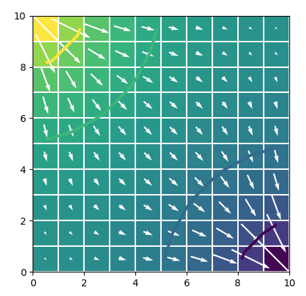

# Software Installation
To get the most out of this workshop, you will need to come prepared with a laptop computer that has Python installed.  **If you are familiar with conda environments and know how to create a new conda environment using an environment.yml file, then skip ahead to Part 2**.  For all others, we recommend using the Miniforge software to download and install Python and required dependencies needed for the workshop.  

The following instructions will guide you through the installation process and setup of a modflow environment.

## Part 1 -- Install Miniforge
1. Go to the miniforge website and download the installer (https://github.com/conda-forge/miniforge) for your platform.

2. Run the installer program that you downloaded.  On Windows the installer is called `Miniforge3-Windows-x86_64.exe`.

3. Click through the installer options, and select "Just Me (recommended)" if asked.  Default installation options should be fine, with the exception that you should select an installation location that does not have any special characters or spaces in it.

4. After installation, you should see "Miniforge Prompt" as a program under the Windows Start menu.  After clicking on it, you should see a terminal open in your user folder:
```
(base) C:\Users\JaneDoe>
```

## Part 2 -- Create modflow Environment
We will use an environment file to create a containerized version of Python and the Python packages needed for the class.  An environment file is simply a list of packages that we want to install in our environment.

1. Using a text editor, such as Notepad or Notepad++, create a file called `environment.yml`. (Pro tip: from the Miniforge prompt type `notepad environment.yml` to create a new file in your user folder.) The new `environment.yml` file should contain the information in [this environment file](./environment.yml).  Caution!  Notepad will automatically append a .txt suffix to your file name (unless you used the pro tip); you don't want this to happen.

2.  At the Miniforge terminal prompt enter the following command
```
conda env create
```

You will need to be connected to the internet for this to work properly.  The installation process may take a couple of minutes.

If the env create command did not work, and you created the `environment.yml` file somewhere else, then try the following, where `<path to file>` is the location of the `environment.yml` file that you created.
```
conda env create --file <path to file>/environment.yml
```

3.  After the environment has been installed, you may activate this new class environment with the following command
```
conda activate modflow
```

4.  The windows terminal prompt should reflect the current environment:
```
(modflow) C:\Users\JaneDoe>
```

5.  We will be using jupyter notebooks in the workshop.  To test if jupyter is installed and working properly use the following command.  After entering this command, the default web browswer should open to a Jupyter Lab page.
```
jupyter lab
```

## Part 3.  Install MODFLOW and related programs

1.  Install MODFLOW executables and related programs.  After the environment has been installed, MODFLOW executables can be downloaded to your computer using the [get-modflow](https://github.com/modflowpy/flopy/blob/develop/docs/get_modflow.md) utility, which is installed with FloPy. The following command is one way to use `get-modflow`, which will download the executables and make them available for use with FloPy scripts.  Make sure that the modflow environment is active before you run `get-modflow`.

```
$ get-modflow :flopy 
```

This command may fail if you are on an internal USGS network.  If you run into problems, try running this command while connected to a public wifi.


## Part 4.  Install Other Required Software

1.  USGS Modelviewer for MODFLOW 6 is available for download [here](https://www.usgs.gov/software/model-viewer-program-three-dimensional-visualization-ground-water-model-results) or [here](https://github.com/MODFLOW-USGS/modelviewer-mf6/releases/tag/1.0.0).  Online documentation for the program is available [here](https://modelviewer-mf6.readthedocs.io/en/latest/).

2.  FeatureGridder and HeadViewer are two Windows programs that are used as training tools for the class.  These programs are included in this repository in the software folder.  Neither of these programs have an installer; instead they can be run by double-clicking on the executable program.

3.  MODFLOW 6 and related utilites.  The latest version of MODFLOW 6 can be downloaded from the [USGS MODFLOW 6 website](https://www.usgs.gov/software/modflow-6-usgs-modular-hydrologic-model).  MODFLOW 6 is also available for other operating systems on the [releases tab](https://github.com/MODFLOW-USGS/modflow6/releases) of the MODFLOW 6 GitHub repository.

4.  To test if everything is working correctly, try copying the [MODFLOW 6 Quick Start](https://github.com/modflowpy/flopy#modflow-6-quick-start) FloPy tutorial into a jupyter notebook.  If everything is installed and working correctly, then you should see the image of a 10-by-10 model grid with flow from the upper left to the lower right.



